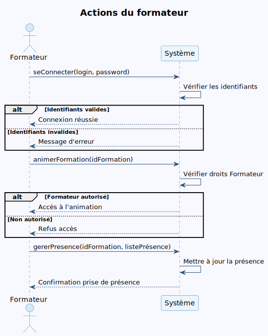
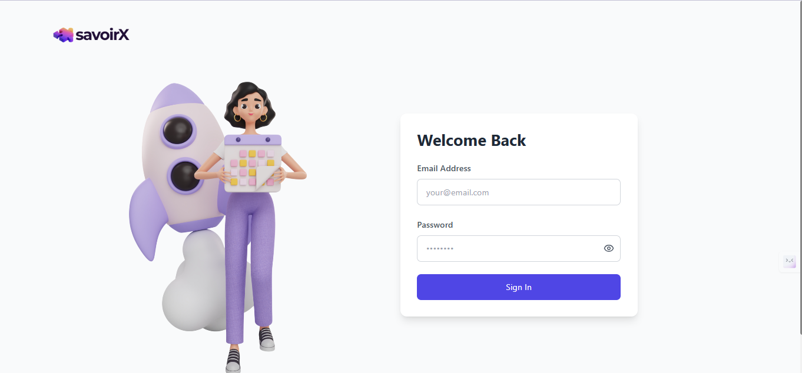
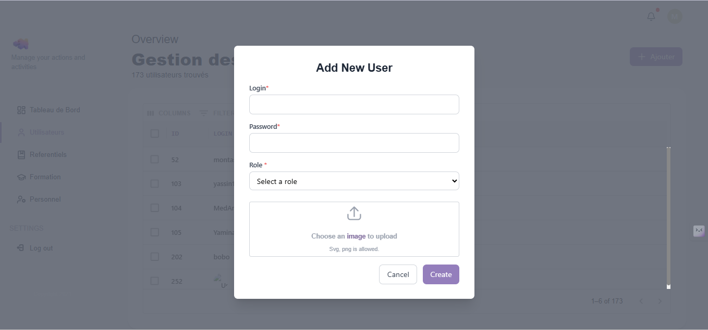

  
  

<h1 align="center">📚 Application de Gestion de Formation 📚</h1>

<h2 align="center">Mini Projet - Base de Données</h2>

  <b>Réalisé par :</b> 
  <b>Montassar Tayachi</b> 
  <b>Nermine Bouzidi</b> 
  <b>Classe : 1ING4</b>

<i>Année universitaire 2024/2025</i>

---

# Rapport de Projet : Application de Gestion de Formation

## 1. Introduction

La formation professionnelle continue est essentielle pour l’évolution des compétences des employés et la performance des entreprises. Ce projet vise à concevoir et développer une application web permettant la gestion complète des formations au sein du centre « Excellent Training » de la société « Green Building ».

## 2. Objectifs du Projet

- Informatiser la gestion des formations, des participants, des formateurs et des statistiques.
- Faciliter la planification, le suivi et l’évaluation des sessions de formation.
- Offrir des droits adaptés à chaque type d’utilisateur (administrateur, responsable, simple utilisateur, formateur).

## 3. Analyse des Besoins

### Acteurs principaux

- **Administrateur** : Accès illimité, gestion des utilisateurs, domaines, structures, profils, et toutes les tâches des autres acteurs.
- **Responsable Centre** : Consultation et analyse des statistiques.
- **Simple Utilisateur** : Gestion des formateurs, formations et participants.
- **Formateur** : Animation des formations et gestion de la présence des participants.

### Principales fonctionnalités

- Authentification et gestion des droits (JWT, Spring Security).
- Gestion des utilisateurs et des rôles.
- Gestion des structures, profils, domaines.
- Gestion des formations (création, modification, ajout de participants).
- Gestion des participants et des formateurs.
- Gestion de la présence des participants par le formateur.
- Consultation, génération et filtrage des statistiques.

## 4. Architecture technique

L’application repose sur une architecture moderne et modulaire :

- **Backend** : Spring Boot (Spring Web, Spring Data JPA, Lombok, etc.), sécurité assurée par Spring Security et authentification JWT.
- **Base de données** : PostgreSQL
- **Frontend** : React.js
- **UI/UX** : Tailwind CSS et Material UI pour des interfaces modernes et responsives
- **Tests d’API** : Postman
- **Génération de données de test** : Faker.js

Ce choix de technologies permet de garantir la robustesse, la sécurité, la maintenabilité et la scalabilité de la plateforme.

## 5. Modélisation UML

### 5.1 Diagramme de cas d'utilisation

### 5.2 Diagramme de classes

### 5.3 Diagrammes de séquence

#### Simple utilisateur

#### Responsable centre

#### Administrateur

#### Formateur

## 6. Conclusion

Ce projet offre une solution complète, moderne et évolutive pour la gestion de la formation professionnelle. Il permet d’automatiser les tâches, d’améliorer la traçabilité et la prise de décision, tout en garantissant la sécurité et la simplicité d’utilisation.

---

## Annexes : Captures d’écran

**Page d'accueil**

**Page de connexion**

**Espace Administrateur**

**Espace Responsable**

**Espace Formateur**

**Espace Utilisateur**

**Ajout d'un utilisateur**

*Annexes : diagrammes UML, extraits du cahier des charges, captures d’écran.*
